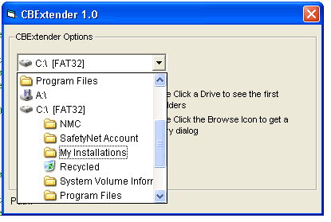



## ICBX V1\.2\! \-ComboBox Extender Class

### Description

A class to extend a common imagecombobox with new features. No uc is required, simply set up the class and go..

Supports in-list directory browsing, a directory browse dialog launched from the list, auto complete, and uses the system image list for icon support.

May 24 - Applied a couple of small fixes and reuploaded.

Hope ya like it..

John
 
### More Info
 

             |
---                |---
**Submitted On**   |2006-05-24 20:11:46
**By**             |[Steppenwolfe](https://github.com/Planet-Source-Code/PSCIndex/blob/master/ByAuthor/steppenwolfe.md)
**Level**          |Intermediate
**User Rating**    |4.8 (38 globes from 8 users)
**Compatibility**  |VB 6\.0
**Category**       |[Complete Applications](https://github.com/Planet-Source-Code/PSCIndex/blob/master/ByCategory/complete-applications__1-27.md)
**World**          |[Visual Basic](https://github.com/Planet-Source-Code/PSCIndex/blob/master/ByWorld/visual-basic.md)
**Archive File**   |[ICBX\_V1\_2\!1996595242006\.zip](https://github.com/Planet-Source-Code/steppenwolfe-icbx-v1-2-combobox-extender-class__1-65458/archive/master.zip)

